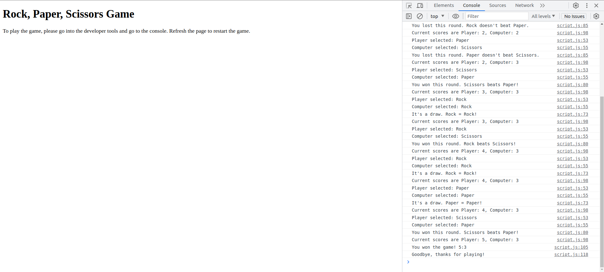

# ODIN ROCK, PAPER, SCISSORS GAME

This rock, paper, scissors game was part of [The Odin Project](https://www.theodinproject.com) course.

## Table of contents

- [Project Overview](#project-overview)
- [Rock Paper Scissors Game](#rock-paper-scissors-game)
  - [Screenshots](#screenshots)
  - [Links](#links)
- [Process](#process)
  - [Built with](#built-with)
  - [What I learned](#what-i-learned)
  - [Continued development](#continued-development)
  - [Useful resources](#useful-resources)
- [Author](#author)

## Project Overview

The assignment was to create a basic rock, paper, scissors game using JavaScript. The main focus was to plan and break down the project into smaller pieces before coding and testing each piece.

- [Plan](TODO)
- [Pseudocode](TODO)

## Rock Paper Scissors Game

### Screenshots

Desktop:  
 TODO

Mobile:  
 TODO

### Links

- Solution URL: [https://github.com/VTickner/odin-rock-paper-scissors](https://github.com/VTickner/odin-rock-paper-scissors)
- Live Site URL: [https://vtickner.github.io/odin-rock-paper-scissors/](https://vtickner.github.io/odin-rock-paper-scissors/)

## Process

TODO

- Created the basic HTML structure of the landing page.
- Created the basic CSS for typography, font sizing and colours.
- Created the CSS layout using flex to match as closely as possible to the design.
- Created a toggle button to switch between two different theme colours (original dark and then a pink themed colour).
- Refactored the CSS to make DRY.
- Added media queries to CSS to create a responsive web design for smaller devices.
- Edited :focus to match styling for keyboard only users.

### Built with

TODO

- HTML5
- CSS3
  - Flexbox
  - Custom properties
- Desktop first responsive layout

### What I learned

TODO
I learnt how to create and switch between two different colour themes.

### Continued development

TODO

### Useful resources

TODO

- [Tint & Shade Generator](https://maketintsandshades.com/) - Free tool that calculates tints and shades for your default colour, to enable you to create a cohesive colour scheme.
- [Coolers Colour Contrast Checker](https://coolors.co/contrast-checker/112a46-acc8e5) - Free tool that allows you to check the colour contrast of the text to background colour for accessibility / readability purposes.

## Author

- V. Tickner
